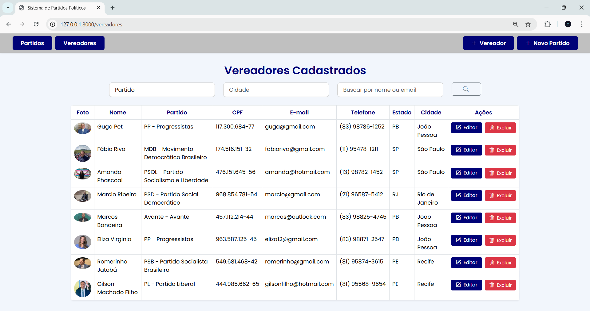
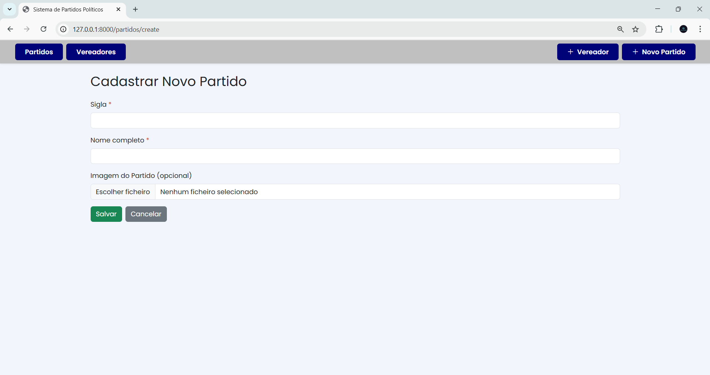
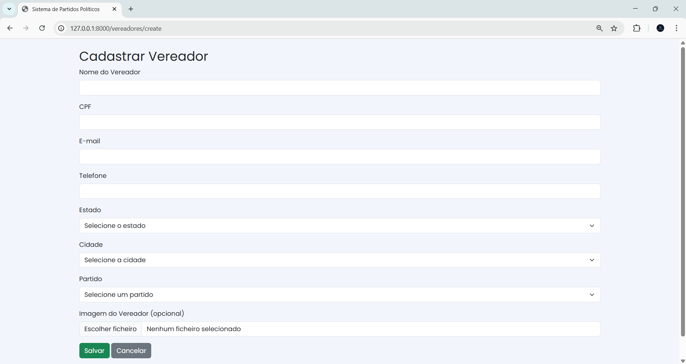
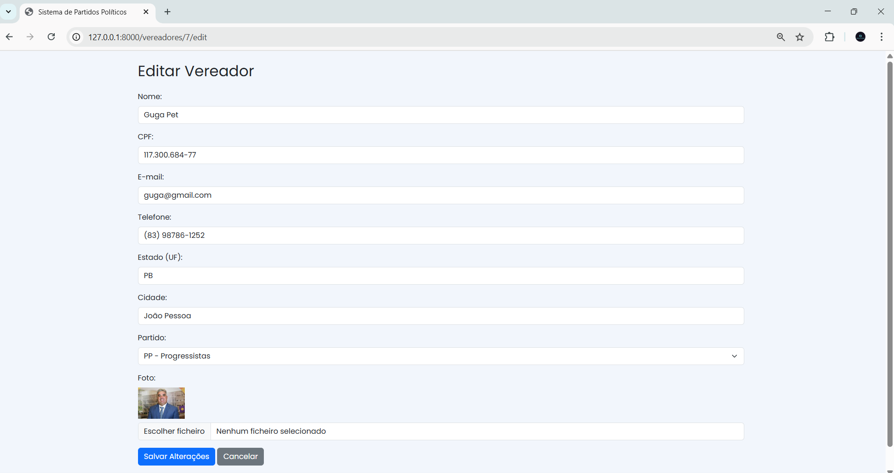
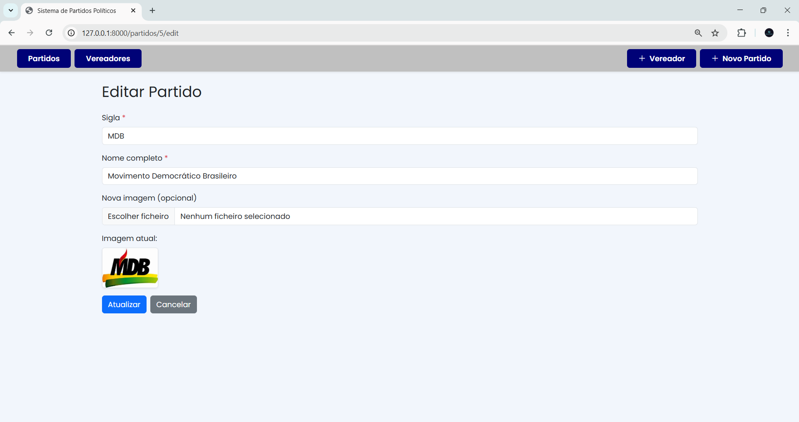
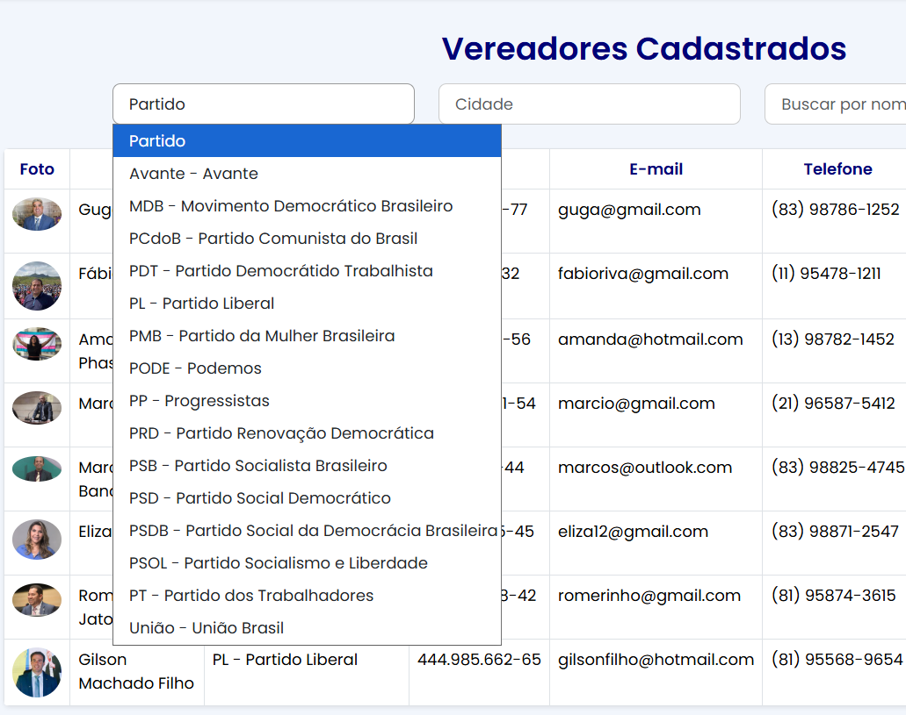

# 🗳️ Sistema de Partidos e Vereadores (CRUD)

Sistema web desenvolvido com **Laravel 10+** para gerenciamento completo de **Partidos** e **Vereadores**.

Ideal para testes técnicos, estudos de CRUD com relacionamentos, validações, manipulação de imagens e consumo de API pública.

---

## 🚀 Funcionalidades

- ✅ CRUD completo de Partidos e Vereadores
- ✅ Validações de CPF, telefone, e-mail e campos obrigatórios
- ✅ Máscaras de entrada para CPF e telefone com JavaScript
- ✅ Upload de imagem com armazenamento em `storage/app/public`
- ✅ Consumo da **API do IBGE** para estados e cidades dinâmicos
- ✅ Design responsivo com **Bootstrap 5**
- ✅ Seeders com 15 partidos e 8 vereadores para testes
- ✅ Relacionamento 1:N entre partidos e vereadores

---

## 🛠️ Tecnologias Utilizadas

- **Laravel 10+**
- **PHP 8.1+**
- **MySQL**
- **JavaScript (API IBGE + máscaras)**
- **Bootstrap 5**
- **Laravel Filesystem (Storage público)**

---

## 📸 Imagens do Sistema

Abaixo algumas capturas de tela do sistema em funcionamento:

### Página Inicial


### Vereadores Cadastrados


### Cadastro de Novo Partido


### Cadastro de Novo Vereador


### Editando Vereador


### Editando Partido


### Filtro por Partido


---

📋 Pré-requisitos
PHP 8.1 ou superior

Composer

MySQL com banco criado

Git

Navegador moderno

---


📥📦 Instalação e configuração

# 1. Clone o projeto
git clone https://github.com/Duartevy/sistema-de-partido.git
cd sistema-de-partido

# 2. Instale as dependências PHP com o Composer
composer install

# 3. Copie o arquivo de ambiente .env e configure seu ambiente local
cp .env.example .env

---

Edite o .env e configure o banco de dados:

```env
DB_CONNECTION=mysql
DB_HOST=127.0.0.1
DB_PORT=3306
DB_DATABASE=sistema_partido
DB_USERNAME=seu_usuario
DB_PASSWORD=sua_senha

⚠️ Certifique-se de já ter criado o banco de dados com o nome sistema_partido no seu MySQL.


---

# 4. Gere a chave da aplicação
php artisan key:generate

# 5. Execute as migrations e seeders
php artisan migrate --seed
✔️ Isso criará todas as tabelas e adicionará automaticamente os 15 partidos e 8 vereadores com imagens.

# 6. Inicie o servidor
php artisan serve

---

📥 Acesse o sistema em: http://127.0.0.1:8000

---

🗂️ Estrutura das Tabelas
*Partidos*

id

sigla

nome

imagem

timestamps


*Vereadores*

id

partido_id (chave estrangeira)

nome

cpf

email

telefone

estado

cidade

imagem

timestamps

---

📦 Seeders
Os seeders inserem 15 partidos e 8 vereadores com dados reais e fotos (já armazenadas no projeto).
São executados automaticamente no comando *php artisan migrate --seed*

---

📝 Observações

O projeto utiliza storage:link automaticamente. Caso precise criar manualmente, use:
*php artisan storage:link*

---

As imagens dos partidos e vereadores ficam em:

storage/app/public/partidos

storage/app/public/vereadores

---

🌐 O projeto utiliza a API oficial do IBGE:

Para listar Estados: https://servicodados.ibge.gov.br/api/v1/localidades/estados

Para listar Cidades: https://servicodados.ibge.gov.br/api/v1/localidades/estados/{sigla}/municipios

---

🧪 Dicas para Testes

Após php artisan migrate --seed:

Crie, edite e exclua Partidos e Vereadores

Teste as máscaras de CPF/telefone

Verifique o carregamento dinâmico de cidades

Visualize miniaturas de imagens após o upload

---


👨‍💻 Autor
Desenvolvido por Milene Duarte
📧 Email: [milenegba@gmail.com]
🔗 LinkedIn/Portfólio: [(https://www.linkedin.com/in/duartevy/)]


📄 Licença
Este projeto é livre para fins de estudo e demonstração.
"""

